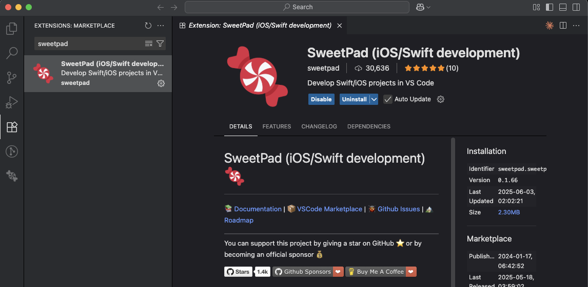
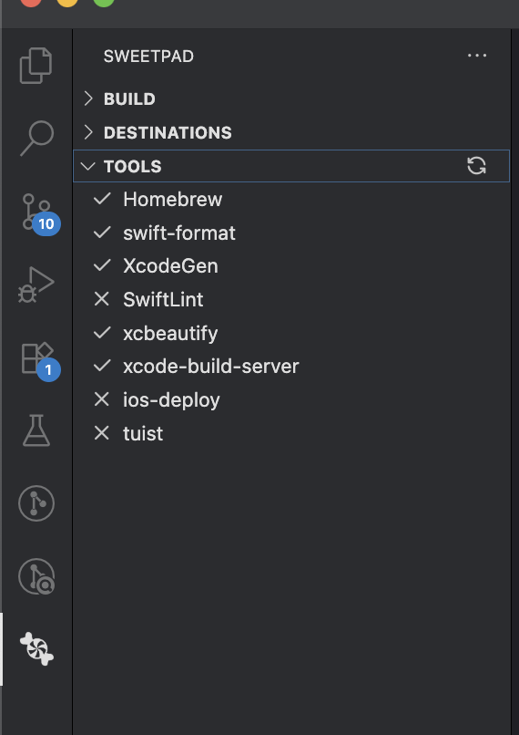
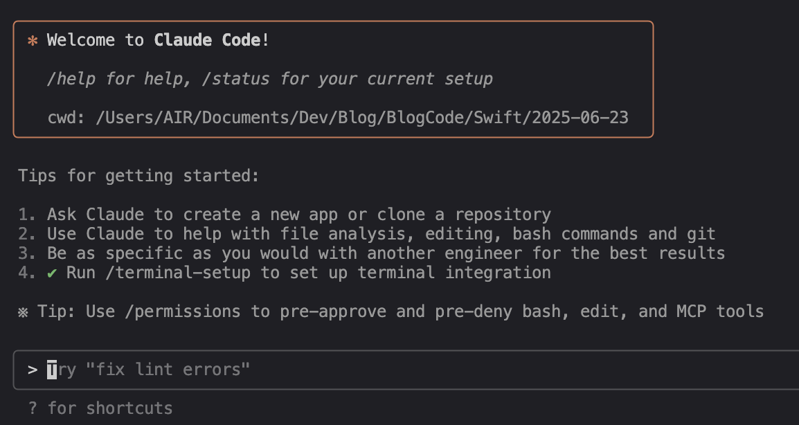
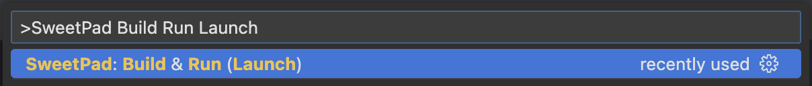
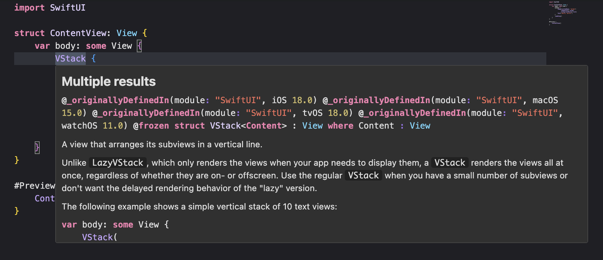

:::note
この記事は人間が書きました。
:::

## はじめに
Claude CodeのVSCode統合が話題になり、iOS開発でもそれらのツールを使用してみたいと思いました。
本記事ではVSCode上でSweetPad、Claude Codeを用いたiOSアプリ開発方法を紹介します。


## 問題
先日のWWDC2025[^1]でXcode 26にLLMが導入され、コードの記述、テスト、ドキュメンテーション作成など行えることが発表されました。
しかし、
- LLMモデルを使用するにはmacOS Tahoe 26が必要なこと
- おそらく正式リリースされるのが9~10月であること

などから待てないので、Claude Codeを使用してiOS開発を行ってみようと思います。

また、Claude CodeはCLIツールでありますがiOSアプリ開発をするにあたって、Xcodeとターミナルの両方を行き来するのは少し面倒なのでVSCode1本で開発ができないかと思ったところにVSCodeの拡張機能であるSweetPadがあったため、導入を行ってみることにしました。

[^1]: https://www.apple.com/jp/newsroom/2025/06/apple-supercharges-its-tools-and-technologies-for-developers/


## それぞれのツールの説明
### SweetPad
VSCode/Cursor上でiOS/Swiftアプリ開発を行うことができます
また、
- swift-format
- swiftlint
- xcodebuild
- xcrun
- xcode-build-server
- sourcekit-lsp

などのオープンソースツールと統合することでXcodeの代わりとなる開発環境を提供することを目的としています。[^2]
[^2]: https://github.com/sweetpad-dev/sweetpad

### Claude Code
Anthropicが開発したターミナル内で動作するAIコーディングアシスタントツールです。
- コード理解: プロジェクト全体の解析、質疑応答
- コード操作: ファイル編集、バグ修正、リファクタリング
- 開発ワークフロー統合: Gitコマンド実行、ビルド・テスト実行

など様々な機能があり、Claude Codeに依頼するか設定ファイルに記載するだけで自動的に作業を行ってくれます。


## セットアップ方法
本記事では各ツールの紹介は別記事で紹介するとして、簡単なセットアップ方法のみを紹介します。
### SweetPad
1. VSCodeの拡張機能で `SweetPad` を検索しインストールします。

2. 左側のパネルに `SweetPad` が追加されているので、必要なツールをインストールします。
- `Homebrew` は必須です
- 今回はXcodeを使用せずにiOSアプリを作成するので、以下は必要です。
  - `XcodeGen`
  - `xcode-build-server`

3. ひとまずSweetPad側の設定は完了です。

### Claude Code
1. Claude Codeをインストールするにはnpmを使用します。
```bash
npm install -g @anthropic-ai/claude-code
```
2. プロジェクトフォルダに移動します。
```bash
cd ProjectDir
```
3. Claude Codeを実行します。
```bash
claude
```
4. 初回のClaude起動時は認証を完了する必要があります。
5. 以上でClaude Codeの簡単なインストールは完了です。


## 実際の開発フロー
### プロジェクト作成から完成まで
ここからは実際にClaude Codeを使用してiOSアプリを作成することを想定して作業してみましょう。

1. 作業するディレクトリに移動し、`claude`コマンドを実行します。
2. 以下のようなClaudeの作業スペースが開きます。

3. 以下のような指示をします。
```
> iOSアプリを作成したいです。\
要件は以下のとおりです。\
- XcodeGenを使用して、プロジェクトファイルを作成する\
- UIはSwiftUIを使用して、Storyboardは使用しない\
- iOSのバージョンは15以上を想定\
- Xcodeのバージョンは16以上を使用\
- ビルドが問題なく通ることを確認する
```
4. するとClaudeが以下のようなToDoリストを作成し、作業に取り掛かります。
```
Update Todos
  ⎿ ☐ XcodeGenをインストール（Homebrewまたは他の方法で）
     ☐ project.ymlファイルを作成（XcodeGen設定）
     ☐ SwiftUIのメインアプリファイルを作成
     ☐ ContentViewファイルを作成
     ☐ XcodeGenでXcodeプロジェクトを生成
     ☐ プロジェクトのビルド確認
```
5. 作業の途中でファイル作成の確認がありますが、この後すべてを自動で行ってほしいので `2. Yes, and don't ask again this session (shift+tab)` を選択します。
```
Opened changes in Visual Studio Code ⧉                  
│  Save file to continue…                               
│                                                       
│ Do you want to make this edit to project.yml?         
│ ❯ 1. Yes                                             
│   2. Yes, and don't ask again this session (shift+tab)
│   3. No, and tell Claude what to do differently (esc) 
```
6. 以下のような表示があれば、自動的にClaudeがファイル操作などを行います。

7. 途中以下のように、コマンド(`mkdir`)を実行してよいかの確認があります。
こちらも自動的に進めたい場合は`2. Yes, and don't ask again for mkdir commands` を選択します。
```
│ Bash command
│
│   mkdir -p SwiftUIApp
│   SwiftUIAppディレクトリを作成
│
│ Do you want to proceed?
│ ❯ 1. Yes
│   2. Yes, and don't ask again for mkdir commands in /Users/AIR/Documents/Dev/Blog/BlogCode/Swift/2025-06-23
│   3. No, and tell Claude what to do differently (esc)
```
8. しばらくすると以下のようなログが出力されアプリがビルドできる状態になっています。
```
⏺ iOSアプリの作成が完了しました。

  作成されたファイル構成：
  - project.yml - XcodeGenの設定ファイル（iOS 15以上、SwiftUI対応）
  - SwiftUIApp/SwiftUIAppApp.swift - メインアプリケーション
  - SwiftUIApp/ContentView.swift - SwiftUIビューファイル
  - SwiftUIApp/Info.plist - アプリ情報ファイル
  - SwiftUIApp.xcodeproj - Xcodeプロジェクト（生成済み）

  ビルドテストも正常に完了し、すべての要件が満たされています。
  ```
9. VSCodeで<kbd>cmd+shift+p</kbd>を押下し、`SweetPad: Build & Run(Launch)` を選択します。


10. アプリをビルドするシミュレーターやプロジェクトの選択などを行うとアプリが起動します。


11. このままだとコード補完や宣言元へのジャンプができないので、buildServerの設定を行います。
VSCodeで<kbd>cmd+shift+p</kbd>を押下し、`>SweetPad: Generate Build Server Config (buildServer.json)`を選択します。

12. すると、このように宣言元の情報やジャンプなどができるようになります。



## まとめ
今回はXcodeを使用せずにiOSアプリを作成する方法をまとめました。
VSCode上でClaude Code、SweetPadを使用することでツールを行き来することなく、スムーズに開発することができます。
しかし依然として以下の機能については制限があります：

- **Interface Builder**: Storyboard/XIB編集
- **Apple公式ツール**: Instruments、Asset Catalogなど
- **デバッグ機能**: Xcodeレベルの詳細デバッグ

これらの機能を使用したい場合はXcodeを併用する必要があります。
XcodeにAI機能が導入されるのを楽しみに待ちましょう。